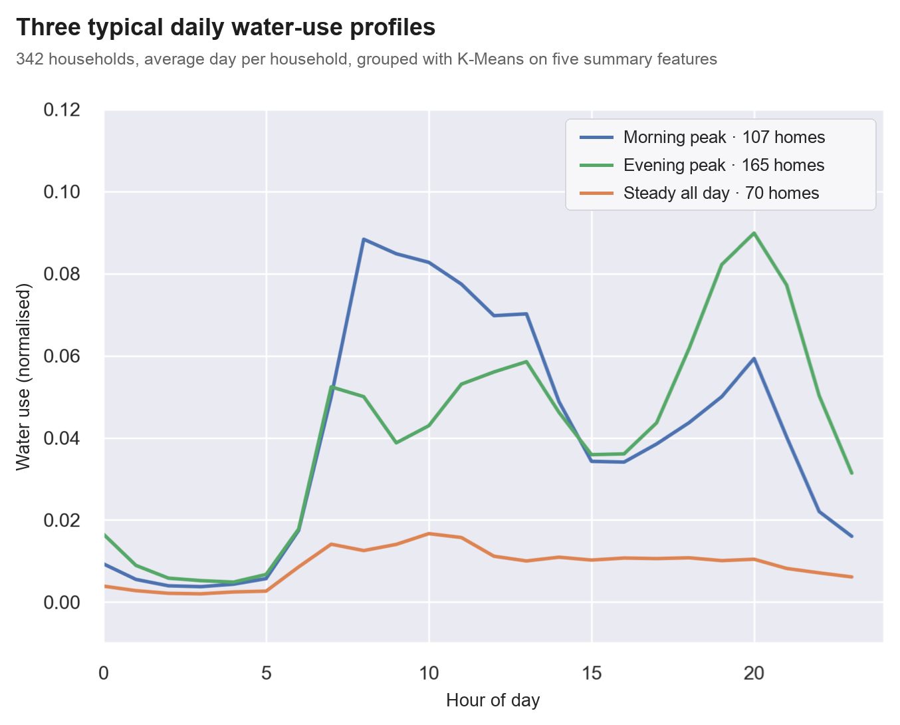
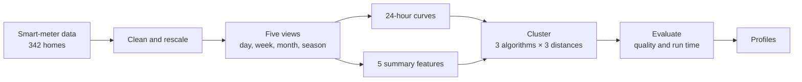

# Household water-use patterns with machine learning

[](environment.yaml)
[](https://repositorium.uminho.pt/entities/publication/c8ec9929-953a-4e22-a9ac-8dec8cd1a096)
[](https://clad.pt/DOC_EVENTOS/BookofAbstracts_joclad2023.pdf#page=119)

Code for my MSc dissertation in Mathematics and Computation (Machine Learning), University of Minho, 2024, graded 19/20. Using smart-meter data from Águas do Norte, I grouped 342 households by how they use water through the day, and compared ways of describing each household to find the best balance of quality and speed.



<sub>Adapted from Figure 6.3(b) of the dissertation, with labels translated into English.</sub>

## Key result

Describing each household with **five summary figures** (average use in four periods of the day, plus how much use varies) instead of its **full 24-hour curve** gave the most consistent results across the quality measures, and it stayed under a tenth of a second as the data grew while the alternatives slowed sharply:

| Profiles clustered | Curves + K-Means | Curves + K-Medoids (DTW)¹ | 5 features + K-Means |
|---|--:|--:|--:|
| 342 (average day per home) | 2.43 s | 8 ms | 44 ms |
| 365 (one per calendar day, all homes) | 1.80 s | 10 ms | 31 ms |
| 1,368 (per home and season) | 12.3 s | 193 ms | 81 ms |
| 2,394 (per home and weekday) | 24.4 s | 481 ms | 73 ms |
| 4,104 (per home and month) | 46.3 s | 1.43 s | **91 ms** |

On the largest set, that is about 500 times faster than K-Means on the full curves.

<sub>Mean of five runs, two clusters, on a 4-core Intel Core i7 laptop (Table 5.18 of the dissertation). ¹ DTW also needs a distance matrix computed in advance, which is not included in these times.</sub>

## How it works



- **Cleaning:** handles missing values and anomalies in the meter readings, and rescales each day by its total so that large and small households can be compared by the shape of their use.
- **Profiles:** builds five views of the data, from one average day per home to one profile per home and month.
- **Clustering:** compares three algorithms with three ways of measuring similarity between curves, including Dynamic Time Warping (DTW), which tolerates small shifts in time.
- **Evaluation:** chooses the number of groups and compares methods on cluster quality and run time, with parallel processing for the slowest steps.

<details>
<summary><b>Repository guide</b></summary>

| Files | Purpose |
|---|---|
| `preprocess.py`, `preprocess_cadastro.py` | Prepare meter and household data |
| `aggregation.py` | Build time aggregations and feature representations |
| `coefficent_variation.py` | Daily consumption variability |
| `distance_matrices_raw.py`, `distance_matrices_norm.py` | Distance matrices for raw and normalised data |
| `opt_k_*.py`, `gap_stat.py`, `gap.R`, `silhouette_ch_ts.py` | Choose and evaluate the number of clusters |
| `analysis_clustering.py`, `new_clustering_analysis.py`, `analysis_data.py`, `centroids.py` | Analyse and interpret the clusters |
| `utils.py`, `utils_clustering.py`, `utils_optimal_k.py` | Shared helpers |
| `environment.yaml` | Conda environment |

</details>

## Running it

```sh
conda env create -f environment.yaml
conda activate water-consumption
pip install --no-build-isolation gap-stat
```

The environment was rebuilt and checked on Python 3.10 in October 2026: every library the scripts import loads, and the clustering libraries run on sample data. `gap-stat` is installed separately because its package no longer builds with pip's default settings.

These are research scripts, not a packaged pipeline, and some steps call R through `rpy2`. The utility's meter data is confidential and not included, so the scripts expect your own input files in `Data/` (for example, `aggregation.py` reads `Data/dfnotnor.csv`).

## Citation

Use the **Cite this repository** button on GitHub, or:

> Bastos, J. M. N. (2024). *Exploração de diferentes técnicas de machine learning para a deteção de padrões de consumo de água* [Exploring different machine learning techniques for detection of water consumption patterns]. MSc dissertation, University of Minho.

Preliminary results: Bastos, J., Ferreira, F., Silva, D., Erlhagen, W. and Bicho, E. (2023). *Clustering analysis for household week-daily water consumption profiles characterization*. JOCLAD 2023, Book of Abstracts, pp. 91–92.

Supervised by Flora Ferreira and Estela Bicho.
